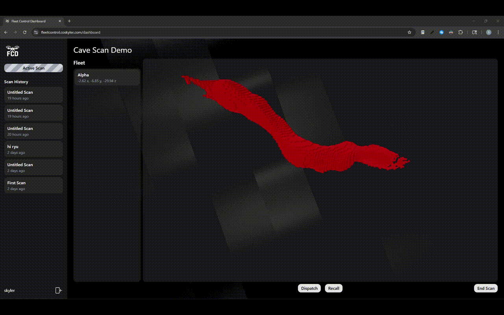
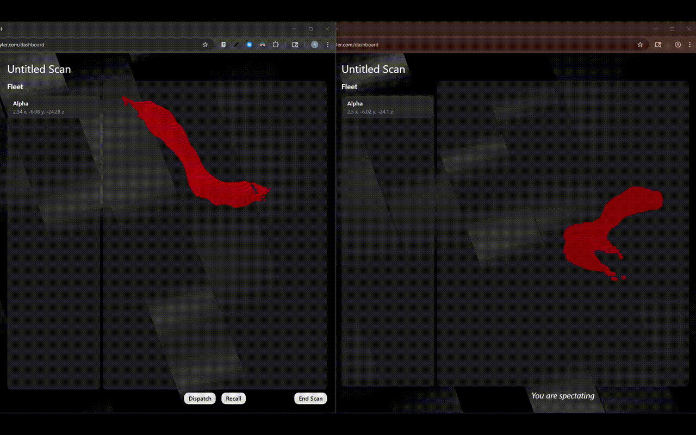

# Fleet Control Dashboard

A real-time dashboard for managing autonomous drone fleets.  
Compatible with [Autonomous Indoor Drone Navigation](https://github.com/coskyler/Autonomous-Indoor-Drone-Navigation).

Built on a custom **fan-out streaming model** with WebSockets and Redis Streams.

## Gallery
**Scanning Demo**  
  

**Supports Multiple Spectators**  
  

See it yourself: [Cave Scan Demo](https://fleetcontrol.coskyler.com/scans/8)

## Features
**Live control & spectator mode** - operators control fleets in real time while others can spectate 
**Reliable streaming** - WebSocket reconnection logic with full scan history 
**Persistent storage** - saved scans can be made public and are accessible anytime 
**3D rendering** - optimized with GPU instancing 
**User accounts & sessions** - secure authentication

## Tech Stack
**Backend:** Javascript, Node.js, Express, WebSockets, Redis, Postgres 
**Frontend:** Typescript, React, Three.js